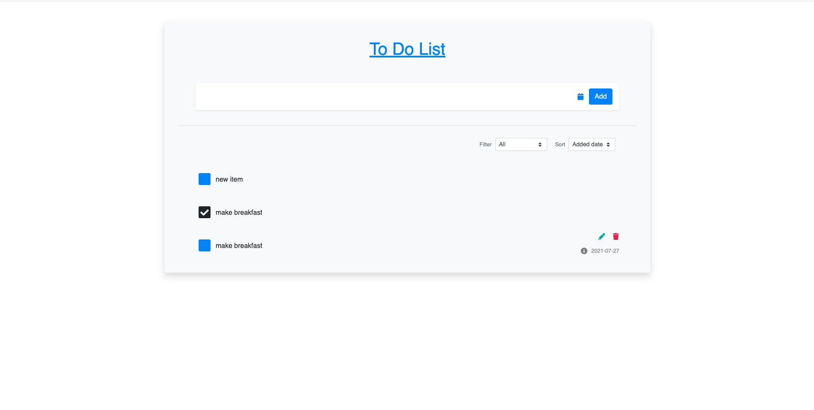

# Flask-ToDo-App

   



[Link To Deployed Application (Using Heroku)](https://aiotodo.herokuapp.com/)


## Description
A To-Do list application designed to help users track their day to day tasks. The application was built using Flask written in Python and uses HTML, CSS and Bootstrap in the front end. The To-Do list entities are stored in sqlalchemy which is included within Flask.
## Table of Contents 
  - [Installation](#installation)
  - [Usage](#usage)
  - [Contributing](#contributing)
  - [Tests](#tests)
  - [Questions](#questions)
  - [License](#license)
## Installation
To install necessary dependencies, run the following command:
``` 
cd <project-repo>
pip install -r requirements
```
## Usage
To run the app locally, use the command:
``` 
python app.py
```
## Contributing
Owner: Adil Hussain
## Tests
To run tests, run the following command:
```
N/A
```

## Code Structure

The entry point to this application lies in the app.py file. This is where an instance of Flask is created and is implemented with the use of routes. The schema for the DB can also be found here as well.

## Questions
If you have any questions about the repo, open an issue or contact me directly at adilh621@gmail.com. You can find more of my work on [GitHub](https://github.com/adilh621).
## License
MIT License

Copyright (c) 2021 Flask ToDo

Permission is hereby granted, free of charge, to any person obtaining a copy
of this software and associated documentation files (the "Software"), to deal
in the Software without restriction, including without limitation the rights
to use, copy, modify, merge, publish, distribute, sublicense, and/or sell
copies of the Software, and to permit persons to whom the Software is
furnished to do so, subject to the following conditions:

The above copyright notice and this permission notice shall be included in all
copies or substantial portions of the Software.

THE SOFTWARE IS PROVIDED "AS IS", WITHOUT WARRANTY OF ANY KIND, EXPRESS OR
IMPLIED, INCLUDING BUT NOT LIMITED TO THE WARRANTIES OF MERCHANTABILITY,
FITNESS FOR A PARTICULAR PURPOSE AND NONINFRINGEMENT. IN NO EVENT SHALL THE
AUTHORS OR COPYRIGHT HOLDERS BE LIABLE FOR ANY CLAIM, DAMAGES OR OTHER
LIABILITY, WHETHER IN AN ACTION OF CONTRACT, TORT OR OTHERWISE, ARISING FROM,
OUT OF OR IN CONNECTION WITH THE SOFTWARE OR THE USE OR OTHER DEALINGS IN THE
SOFTWARE.
